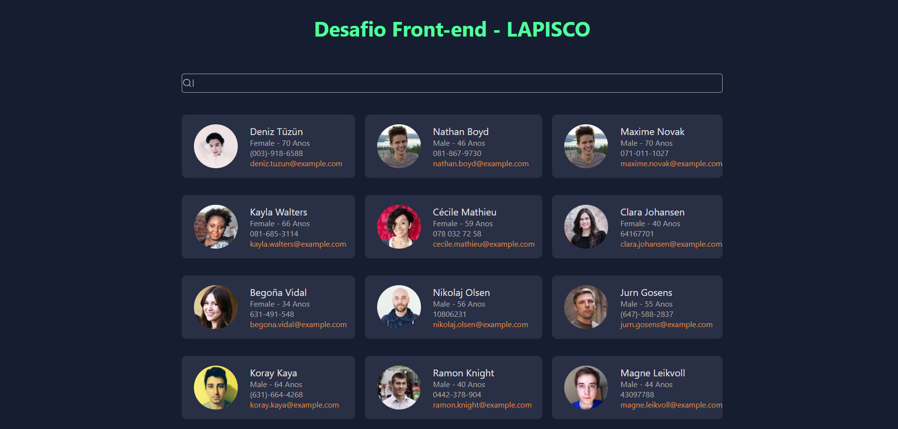

# Desafio Front-End Lapisco

Este projeto é um artefato do processo seletivo para o Laboratory of Image Processing, Signals and Computer Science ([LAPISCO](https://lapisco.ifce.edu.br))

# Autor

Jonas Miranda

## Como utilizar

Para iniciar o projeto, deverá ser executado:

### `npm install`

### `npm start`

Inicia o app em modo desenvolvedor
Abra [http://localhost:3000](http://localhost:3000) para visualizar o projeto no navegador.

## Projeto

Foram implementados os seguintes componentes:

- Título
- Barra de pesquisa com filtro dinâmico enquanto digita
- Cartões exibidos em modo grade
- Busca dos perfis pela API: https://randomuser.me/api/

### Referências

Curso React Alura: https://cursos.alura.com.br/course/react-js

Card Grid - Listando os Users: https://www.youtube.com/watch?v=0r8UWrQJa-w

Search Filter React Tutorial: https://www.youtube.com/watch?v=mZvKPtH9Fzo

Documentação React: https://pt-br.reactjs.org

Documentação JavaScript: https://developer.mozilla.org/pt-BR/docs/Web/JavaScript
